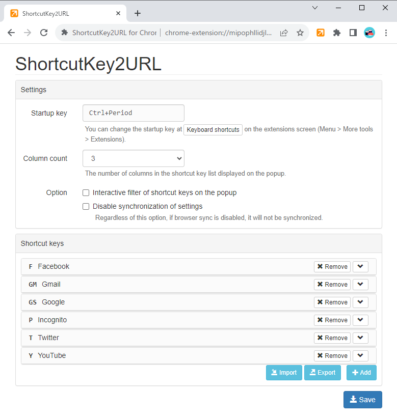

# ShortcutKey2URL for Chrome

ShortcutKey2URL for Chromeは、ショートカットキーを使用してURLを開いたり、移動したり、JavaScriptを実行できるGoogle Chrome向け拡張機能です。

スタートアップキーであらかじめ設定しておいた動作の一覧を表示し、次のキーでその動作を実行します。  
スタートアップキーは、デフォルトの状態ではCtrl+.(ピリオド)です。このキーは後から変更できます。(Macでは、Command+,(カンマ))

キーとして使用できる文字は1文字に限定されません。複数文字として設定しておくことが可能です。ShrotcutKey2URLは、キーとして連続して入力された文字から、対象が1つに絞り込まれた時点でその動作を実行します。

動作として設定できるものには、下記のようなものがあります。

* URLへの移動。既に開いているURLの場合は、そのタブへ移動し、開かれていない場合には、新しいタブとして開く。
* 新規タブとしてURLを開く。
* 現在のタブにURLを開く。
* 現在のタブで指定したJavaScriptを実行する。
* 新規タブとしてURLを開いて、その後に指定したJavaScriptを実行する。
* シークレットウインドウに指定のURLを開く。
* シークレットウインドウに現在のタブと同じURLを開く。

**Manifest V3 の制限により、文字列としてJavaScriptを指定できなくなりました。**  
**拡張機能がインストールされたフォルダ配下にある`user-script.js`にて、実行したいJavaScriptをあらかじめ記載しておく必要があります。**
**詳しくは [Scriptの指定方法](#scriptの設定方法) をご参照ください。**

## インストール

下記からインストールします。

* [ShortcutKey2URL for Chrome - Chrome ウェブストア](https://chrome.google.com/webstore/detail/shortcutkey2url-for-chrom/hfohmffbfcobmhfgpkbcjjaijmfplcdg "ShortcutKey2URL for Chrome - Chrome ウェブストア")

## スタートアップキーの設定

スタートアップキーは、 Menu > More tools > Extensions の Keybord shortcuts から変更できます。


## 操作方法

スタートアップキーを押下すると、ポップアップにてショートカットの一覧が表示されます。


一覧にあるキーを入力すると、対応するショートカットが実行されます。


## ショートカットの設定

設定画面でショートカットキーを設定します。



### Settings

`Column count` は、ポップアップで表示するショートカットの列数を指定します。  
左が`2`を指定した場合、右が`3`を指定した場合です。

 

`Option`の`Interactive filter of shortcut keys on the popup`をチェックすると、ポップアップで表示するショートカットをインタラクティブに絞り込むことができます。


`Disable synchronization of settings`をチェックすると、設定の同期を無効化できます。  
ブラウザの同期を行っているけれども、ショートカットキーは分けたいといった場合に有用です。

### Shortcut Keys

`Add current page`をクリックすると、現在のページをショートカットキーとして簡単に設定できます。


コンテキストメニューからも追加可能です。


`Key`にはショートカットキーとして割り当てるキーを設定します。複数文字とすることも可能です。
スタートアップキーを押下後、ここで設定したキーを押下することによって、ショートカットが実行されます。

`Hide in shortcut key list displayed in popup`にチェックを付けると、ポップアップで表示されるショートカットの一覧にて非表示とすることができます。  
非表示となるだけで、ショートカットキーとしては有効です。

`Action`でショートカットキーとしての動作を指定します。  
指定できるものは、下記の通りです。

* `Jump to url` URLへの移動。既に開いているURLの場合は、そのタブへ移動し、開かれていない場合には、新しいタブとして開く。
* `Jump to url (Including other windows)` URLへの移動。`Jump to url`との違いは、対象が全てのウインドウとなることです。
* `Open url in new tab` 新規タブとしてURLを開く。
* `Open url in current tab` 現在のタブにURLを開く。
* `Execute script` 現在のタブで指定したJavaScriptを実行する。
* `Open url in incognito window` シークレットウインドウでURLを開く。
* `Open current tab in incognito window` シークレットウインドウで現在のタブを開く。

`Script (optional)`を指定することによって、URLを開いた後に任意のJavaScriptを実行することができます。

### 同期

同期に対応しているので、ショートカットキーなどの設定がPC間で共有されます。  
ただし、同期で保存可能な容量に制限があるため、同期で保存できないサイズだった場合には、同期せずに保存します。

### Import / Export

ショートカットキーの一覧は、エクスポート / インポートが可能です。  
これによりバックアップを取ったり、移行を行うことができます。(FirefoxとChrome間での移行など)

## Scriptの設定方法

`Script`で選択するものは、拡張機能がインストールされたフォルダ配下にある`user-script.js`にて定義しておく必要があります。  
**これは Manifest V3 の制限により、文字列としてJavaScriptを指定できなくなったためです。** 

拡張機能のインストールフォルダの探し方は、下記を参考にしてください。

* [Where does Chrome store extensions? \- Stack Overflow](https://stackoverflow.com/questions/14543896/where-does-chrome-store-extensions/14544700#14544700)

`user-script.js`の`USER_SCRIPT`として定義した内容が、`Script`の選択肢として表示されます。
`user-script.js`には、あらかじめ例となるコードが記載されています。

```js
const USER_SCRIPTS = [
  {
    id: 'scroll-to-bottom',
    title: '(Example) Scroll to bottom',
    func: () => {
      window.scrollTo({
        top: document.body.scrollHeight,
        behavior: 'smooth'
      });
    }
  },
  {
    id: 'save-to-pinboard',
    title: '(Example) Save to Pinboard',
    func: () => {
      // https://pinboard.in/howto/#saving
      q = location.href; if (document.getSelection) { d = document.getSelection(); } else { d = ''; }; p = document.title; void (open('https://pinboard.in/add?url=' + encodeURIComponent(q) + '&description=' + encodeURIComponent(d) + '&title=' + encodeURIComponent(p), 'Pinboard', 'toolbar=no,width=700,height=350'));
    }
  }
];
```


1つのスクリプトは、下記の3つのプロパティから構成されます。

* `id` : 一意に識別するためのIDです。画面には表示されませんが、設定値としてこの値が保存されます。
* `title` : 設定画面で選択肢として表示される名前です。
* `func` : 実際に実行される関数です。

新しいスクリプトを用意する際には、ここに追記してください。

拡張機能のバージョンアップ時に本ファイルはリセットされてしまいますので、バックアップを取っておいたうえで、バージョンアップ後に再度修正するようお願いします。
