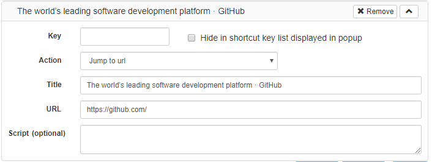

# ShortcutKey2URL for Chrome

ShortcutKey2URL for Chromeは、ショートカットキーを使用してURLを開いたり、移動したり、JavaScriptを実行できるGoogle Chrome向け拡張機能です。

スタートアップキーであらかじめ設定しておいた動作の一覧を表示し、次のキーでその動作を実行します。

スタートアップキーは、デフォルトの状態ではCtrl+.(ピリオド)です。このキーは後から変更できます。(Macでは、Command+,(カンマ))

キーとして使用できる文字は1文字に限定されません。複数文字として設定しておくことが可能です。ShrotcutKey2URLは、キーとして連続して入力された文字から、対象が1つに絞り込まれた時点でその動作を実行します。

動作として設定できるものには、下記のようなものがあります。

* URLへの移動。既に開いているURLの場合は、そのタブへ移動し、開かれていない場合には、新しいタブとして開く。
* 新規タブとしてURLを開く。
* 現在のタブにURLを開く。
* 現在のタブで指定したJavaScriptを実行する。
* 新規タブとしてURLを開いて、その後に指定したJavaScriptを実行する。

## インストール

下記からインストールします。

* [ShortcutKey2URL for Chrome - Chrome ウェブストア](https://chrome.google.com/webstore/detail/shortcutkey2url-for-chrom/hfohmffbfcobmhfgpkbcjjaijmfplcdg "ShortcutKey2URL for Chrome - Chrome ウェブストア")

## スタートアップキーの設定

スタートアップキーは、 Menu > More tools > Extensions の Keybord shortcuts から変更できます。

## 操作方法

スタートアップキーを押下すると、ポップアップにてショートカットの一覧が表示されます。

一覧にあるキーを入力すると、対応するショートカットが実行されます。

## ショートカットの設定

設定画面でショートカットキーを設定します。

`Add current page`をクリックすると、現在のページをショートカットキーとして簡単に設定できます。

`Action`として指定できるものは、下記の通りです。

* `Jump to url` URLへの移動。既に開いているURLの場合は、そのタブへ移動し、開かれていない場合には、新しいタブとして開く。
* `Open url in new tab` 新規タブとしてURLを開く。
* `Open url in current tab` 現在のタブにURLを開く。
* `Execute script` 現在のタブで指定したJavaScriptを実行する。

`Script (optional)`を指定することによって、URLを開いた後に任意のJavaScriptを実行することができます。
