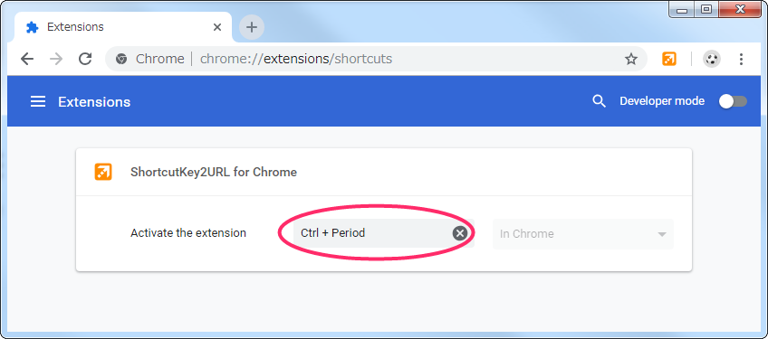
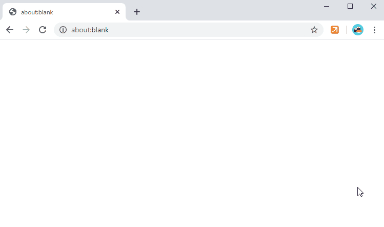
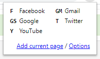
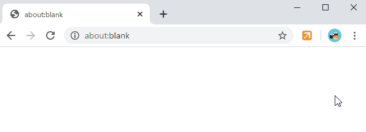

# ShortcutKey2URL for Chrome

ShortcutKey2URL for Chrome is an extension for Google Chrome that allows you to open, and move url using shortcut keys. You can also run JavaScript.

Display the action list with the startup key and execute the action with the next key.  
The startup key default is Ctrl+Period(on mac, Command+Comma). You can change this key later. 

Characters that can be used as keys are not limited to one character. It can be set as multiple characters. ShrotcutKey2URL executes its action from the characters entered consecutively as keys when the target is narrowed down to one.

The items that can be set as actions are as follows.

* Jump to URL. For already opened URL, go to that tab. Open it as a new tab if it is not already open.
* Open URL in new tab.
* Open URL in current tab.
* Execute the JavaScript on the current tab.
* Open URL as a new tab and then execute the JavaScript.
* Open specified URL in incognito window.
* Open same URL as the current tab in incognito window.

**Due to a limitation in Manifest V3, it is no longer possible to specify JavaScript as a string.**  
**You must specify the JavaScript you wish to execute in advance in the `user-script.js` file under the folder where the extension is installed. For details, please refer to [How to Specify Script](#how-to-specify-script).**

## Installation

Install from the following.

* [ShortcutKey2URL for Chrome - Chrome Web Store](https://chrome.google.com/webstore/detail/shortcutkey2url-for-chrom/hfohmffbfcobmhfgpkbcjjaijmfplcdg "ShortcutKey2URL for Chrome - Chrome Web Store")

## Setting the startup key

You can change the startup key from Keybord shortcuts in Menu > More tools > Extensions.



## Usage

When you press the startup key, a list of shortcuts is displayed in the popup.


When you enter a key, the corresponding shortcut will be executed.



## Shortcut settings

Set the shortcut key on the setting screen.


### Settings

`Column count` specifies the number of columns of the shortcut to be displayed in the popup.  
The left is when `2` is specified, and the right is when `3` is specified.

 

If you check `Interactive filter of shortcut keys on the popup` of `Option`, you can interactively narrow down the shortcuts displayed in the popup.



Check `Disable synchronization of settings` to disable synchronization of settings.  
This is useful if you browser sync enabled but want to keep shortcut keys separate.

### Shortcut Keys

Click to `Add current page`, you can easily set the current page as a shortcut key.


It is also possible to add from the context menu.


Set a key to be assigned as a shortcut key in `Key`. It can be multiple characters.  
After pressing the startup key, press the key set here to execute the shortcut.

If you check `Hide in shortcut key list displayed in popup`, you can hide it in the shortcut list displayed in the popup.  
It is only hidden and is effective as a shortcut key.

Specify the action as a shortcut key with `Action`.  
The following can be specified.

* `Jump to url` Jump to URL. For already opened URL, go to that tab. Open it as a new tab if it is not already open.
* `Jump to url (Including other windows)` Jump to URL. The difference from `Jump to url` is that the target is all windows.
* `Open url in new tab` Open URL in new tab.
* `Open url in current tab` Open URL in current tab.
* `Execute script` Execute JavaScript on current tab.
* `Open url in incognito window` Open URL in incognito window.
* `Open current tab in incognito window` Open current tab in incognito window.

By entering `Script (optional)` you can execute arbitrary JavaScript after opening the URL.

### Sync

Sync is supported, so shortcut keys and other settings are shared among PCs.  
However, if the size of the settings is too large to be saved by synchronization, it will be saved without synchronization because there is a limit to the amount of space that can be saved by synchronization.

### Import / Export

The list of shortcut keys can be exported / imported.  
This allows you to take backups and perform migrations. (E.g. migration between Firefox and Chrome)

## How to Specify Script

The `Script` to be selected must be defined in `user-script.js` under the folder in which the extension is installed.  
**This is due to a restriction in Manifest V3 that no longer allows JavaScript to be specified as a string.** 

Please refer to the following for information on how to locate the extension installation folder.

* [Where does Chrome store extensions? \- Stack Overflow](https://stackoverflow.com/questions/14543896/where-does-chrome-store-extensions/14544700#14544700)

The content defined as `USER_SCRIPT` in `user-script.js` will be displayed as the `Script` choices.
The `user-script.js` contains an example code in advance.

```js
const USER_SCRIPTS = [
  {
    id: 'scroll-to-bottom',
    title: '(Example) Scroll to bottom',
    func: () => {
      window.scrollTo({
        top: document.body.scrollHeight,
        behavior: 'smooth'
      });
    }
  },
  {
    id: 'save-to-pinboard',
    title: '(Example) Save to Pinboard',
    func: () => {
      // https://pinboard.in/howto/#saving
      q = location.href; if (document.getSelection) { d = document.getSelection(); } else { d = ''; }; p = document.title; void (open('https://pinboard.in/add?url=' + encodeURIComponent(q) + '&description=' + encodeURIComponent(d) + '&title=' + encodeURIComponent(p), 'Pinboard', 'toolbar=no,width=700,height=350'));
    }
  }
];
```


A single script consists of the following three properties.

* `id` : ID for unique identification. This value is not displayed on the screen, but is stored as a configuration value.
* `title` : This is the name that appears as an option on the settings screen.
* `func` : The function that is actually executed.

When preparing new scripts, please add here.

This file will be reset when the extension is upgraded, so please make a backup and modify it again after the upgrade.
